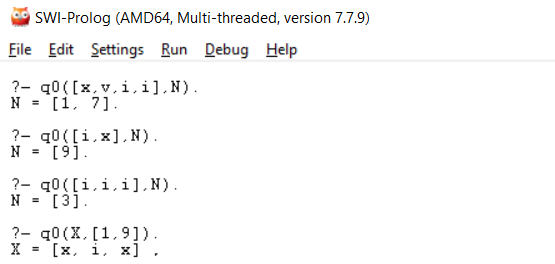

# CSE-567-Computational_Linguistic
Natural Language Processing Projects (implmented in Prolog)

## Roman Decimal Convertor
Prolog program to conver Roman to Decimal and vice-versa till 20 numbers

Sample outputs:

## Bigram Model Sentence Evaluator
Prolog project for application of bigram model to evaluate the correctness of english sentence
