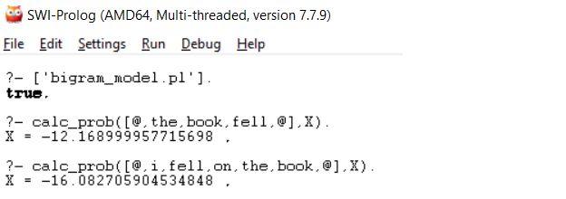
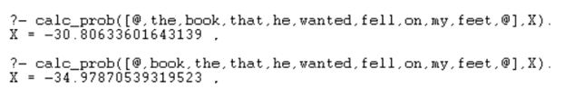
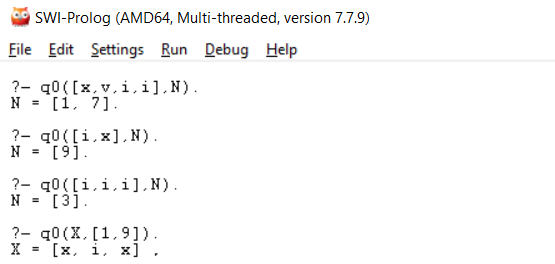
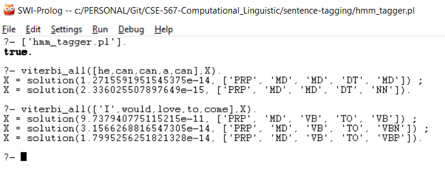

# CSE-567-Computational_Linguistic
Natural Language Processing programs and projects (implmented in Prolog)
##
## 1) Project - Bigram Model Sentence Evaluator
**Problem:** Prolog project to evaluate the correctness of english sentence using bigram model

**Approach:**
The project constructs a Prolog bigram language model using small [DA_Corpus.text](bigram-sentence-evaluator/DA_Corpus.txt) corpus.

Steps taken ([bigram_model.pl](bigram-sentence-evaluator/bigram_model.pl)):

1. The [DA_Corpus.text](bigram-sentense-evaluator/DA_Corpus.txt) corpus is normalized using [unix](bigram-sentence-evaluator/unix_commands.txt) commands.
2. Created a prolog readable [unigram.pl](bigram-sentence-evaluator/unigrams.pl) and [bigram.pl](bigram-sentence-evaluator/bigrams.pl) database from normalized corpus.
3. In the final step, implemented [bigram_model.pl](bigram-sentence-evaluator/bigram_model.pl) which computes the probability of any word sequence, of any size, via a predicate called **calc_prob/2**. The predicate calc_prob/2 works in log space and applies laplace smoothing on fly to compute the probability of given sentence.

**Sample outputs:** 
As shown in the output below, sentence like "the book fell" will have better value than "i fell on the book"

Similarly the sentence like "the book that he wanted fell on my feet" will have better value than "book the that he wanted fell on my feet"

##
## 2) Program - Roman Decimal Convertor
**Problem:** Prolog program to convert Roman to Decimal and vice-versa till 20 numbers

**Program:** [RomanDecimalConversion.pl](roman-decimal-convertor/RomanDecimalConversion.pl)

**Sample outputs:** 

##
## 3) Project - Sentence Tagger

**Problem:** Identify all possible tags for given sentence with there correctness probability.

**Approach:** The project makes use of Viterbi algorithm to compute all the possible tag list with probability for given sentence.
[tagger.pl](sentence-tagging/hmm_tagger.pl)

**Sample outputs:**

##
## 4) Project - Word Similarity
**Problem:** Prolog project for finding the cosine similarity between two given words and finding most similar words of a given word

**Approach:**
  In progress..
