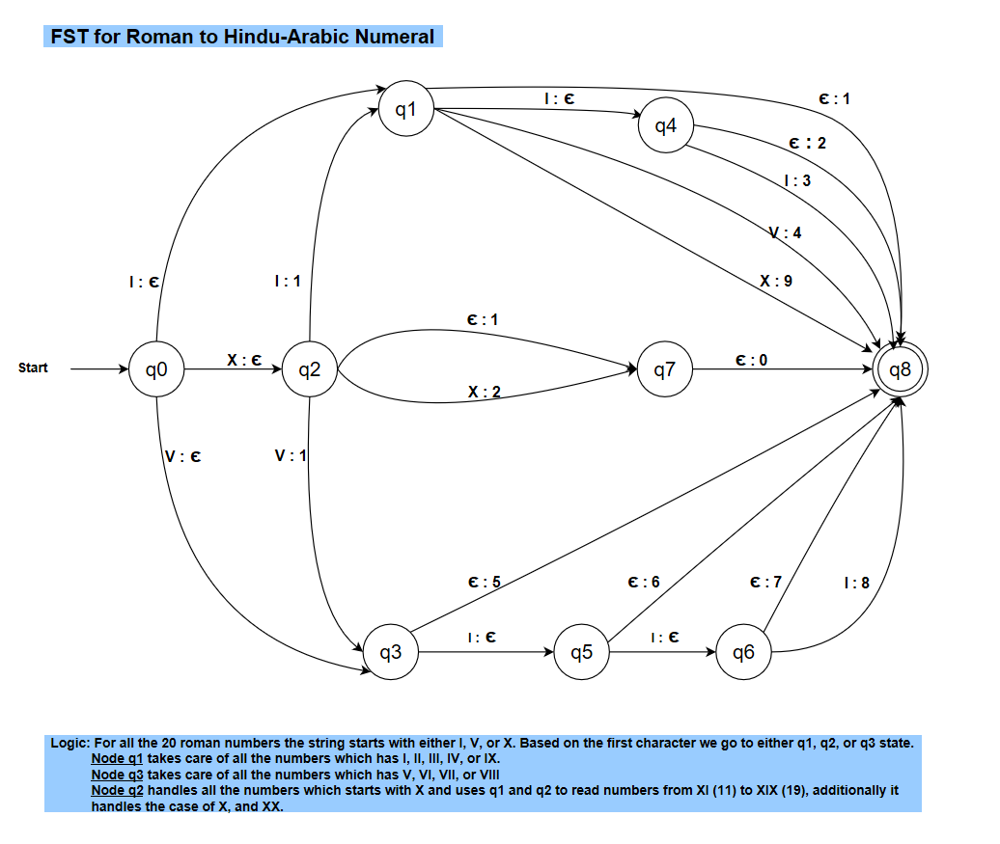

# CSE-567-Computational_Linguistic
Natural Language Processing Projects (implmented in Prolog)

## Roman Numerals Conversion
Prolog program to convert the Roman to Decimal till 20 numbers

Sample output:

The FST for the program is:

